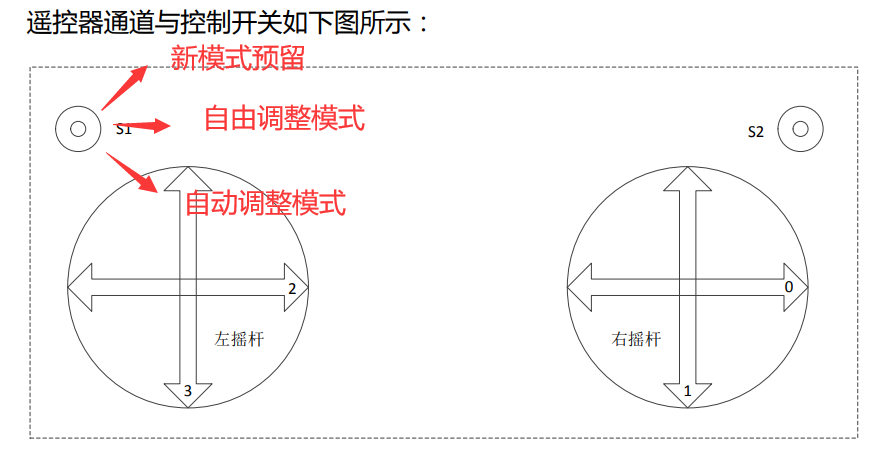

# MechaX 飞镖
## 使用说明

### 模式选择


### 模式介绍

由于无法获取飞镖当前朝向（仅有一块A板），最好在使用自动发射功能前将飞镖朝向正前方

##### 模式一：一键攻击前哨站（主要是一键发射）

往上拨就是打16m

##### 模式二：自动攻击基地（一键偏转+发射+返回）

往下拨就是打25m

先旋转指定角度，发射，再转回原角度

##### 模式三：自主操作模式

为甚么用摇杆装填？因为用按键容易忘记关



## 功能代码
### 模式选择

```c
//s键 1上 2下 3中
void dart_shoot_task(void const * argument)
{
  dart_init();
  for(;;)
  {
    //模式1 打击前哨站，并全自动发射飞镖
    if(rc_ctrl.rc.s[0] == 1)
    {
      dart_mode_1();
    }
    //模式2 打击基地，此时飞镖会自动转置右方x度，并自动发射飞镖,
    else if(rc_ctrl.rc.s[0] == 2)
    {
      dart_mode_2();
    }
    //模式3 自由调整模式
    else if(rc_ctrl.rc.s[0] == 3)
    {
      dart_mode_3();
    }
  }
}
```

### 模式二核心代码
##### 调整yaw轴

```c
//模式2 打击基地，此时飞镖会自动转置右方x度，并全自动发射飞镖，发射完成后会自动回中
/*
yaw_state = 0:yaw轴未偏转置指定位置
yaw_state = 1:yaw轴偏转至指定位置
yaw_state = 2:飞镖发射完成，yaw轴可以回转
yaw_state = 3:yaw轴回转完成

dart_state = 0: 飞镖未发射
dart_state = 1: 飞镖已发射
*/
void gesture_mode_2()
{
  
  if(dart.yaw_state == 0 || dart.dart_state == 0) // 如果yaw轴未偏且未发射
  {
    for(int i=0;i<20;i++)
    {
    HAL_GPIO_WritePin(GPIOD,GPIO_PIN_14,RESET);
    HAL_GPIO_WritePin(GPIOD,GPIO_PIN_13,SET);
    Delay_us(50);
    HAL_GPIO_WritePin(GPIOD,GPIO_PIN_13,RESET);
    Delay_us(50);
    }
    dart.yaw_state = 1;
  }

  if(dart.yaw_state == 2 || dart.dart_state == 1) // 如果yaw轴偏转且已经发射
  {
    for(int i=0;i<20;i++)
    {
    HAL_GPIO_WritePin(GPIOD,GPIO_PIN_14,SET);
    HAL_GPIO_WritePin(GPIOD,GPIO_PIN_13,SET);
    Delay_us(50);
    HAL_GPIO_WritePin(GPIOD,GPIO_PIN_13,RESET);
    Delay_us(50);
    }
    dart.yaw_state = 3; //表示任务已经完成
  }
}

```

##### 控制装填
```c

//模式2 打击基地，此时飞镖会自动转置右方x度，并全自动发射飞镖，发射完成后会自动回中
void reload_mode_2()
{
  fp32 speed = dart.speed_reload;
  int16_t current = dart.motor[4].motor_measure.given_current;

  if(dart.yaw_state == 1)
  {
    //电流检测，如果检测到电流过大，则反转一段时间
    if(current > 9000 || dart.dart_state == 1) 
    {
      dart.dart_state = 1;   //告诉发射部分发射已完成
      dart.yaw_state = 2;    //告诉yaw轴可以转回去了

      dart.motor[4].target_speed = -speed; //开始反转

      if(current < -9000)
      {
        dart.motor[4].target_speed = speed; //正转一会儿
        dart.dart_state = 2; 
      }
    }
    if(dart.dart_state == 0)
    {
      dart.motor[4].target_speed = speed; //正常工作状态下，飞镖装填飞镖
    } 
  }
  else
  {
    dart.motor[4].target_speed = 0;
  }
 
  reload_speed_send();
}

```

##### 发射导弹

```c
//全自动打击基地
//s键 1上 2下 3中
void dart_mode_2()
{
  fp32 speed = dart.speed_25;

  // 只有在飞镖未发射且yaw轴到达指定角度后飞镖发射
  if(dart.dart_state == 0 && dart.yaw_state == 1)
  {
    HAL_GPIO_WritePin(LED_GREEN_GPIO_Port,LED_GREEN_Pin,GPIO_PIN_RESET);
    //给出速度期望值
    dart.motor[0].target_speed =  speed; 
    dart.motor[1].target_speed =  speed;
    dart.motor[2].target_speed = -speed;
    dart.motor[3].target_speed = -speed;
  }
  else
  {
    dart.motor[0].target_speed =  0; 
    dart.motor[1].target_speed =  0;
    dart.motor[2].target_speed =  0;
    dart.motor[3].target_speed =  0;
  }
  dart_speed_send();
}
```

### 模式一核心代码

##### 装填

```c

//模式1 打击前哨站，自动发射飞镖
void reload_mode_1()
{
  fp32 speed = dart.speed_reload;
  int16_t current = dart.motor[4].motor_measure.given_current;

  if(dart.dart_state == 0)
  {
    dart.motor[4].target_speed = speed;
  }
  //电流检测，如果检测到电流过大，则反转一段时间
  if(current > 9000 || dart.dart_state == 1) 
  {
    dart.motor[4].target_speed = -speed; //开始反转
    dart.dart_state = 1;   //告诉发射部分发射已完成
    if(current < -9000)
    {
      dart.motor[4].target_speed = speed; //反转一会儿
      dart.dart_state = 2;
    }
  }
  else
  {
    dart.motor[4].target_speed = 0;
  }

  dart.dart_state = 1;
  osDelay(10);

}
```

##### 发射

```c
//全自动打击前哨站
//s键 1上 2下 3中
void dart_mode_1()
{
  fp32 speed = dart.speed_16;

  //飞镖未发射的时候才发射
  if(dart.dart_state == 0)
  {
    HAL_GPIO_WritePin(LED_GREEN_GPIO_Port,LED_GREEN_Pin,GPIO_PIN_SET);

    dart.motor[0].target_speed =  speed; 
    dart.motor[1].target_speed =  speed;
    dart.motor[2].target_speed = -speed;
    dart.motor[3].target_speed = -speed;
  }
  else
  {
    dart.motor[0].target_speed =  0; 
    dart.motor[1].target_speed =  0;
    dart.motor[2].target_speed =  0;
    dart.motor[3].target_speed =  0;
  }
  dart_speed_send();
  osDelay(1);
}

```


