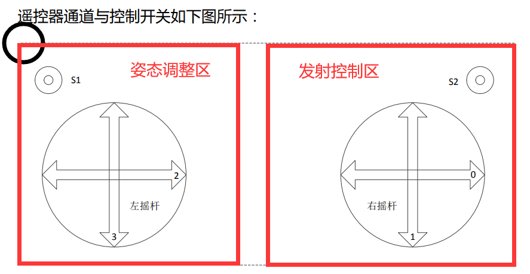
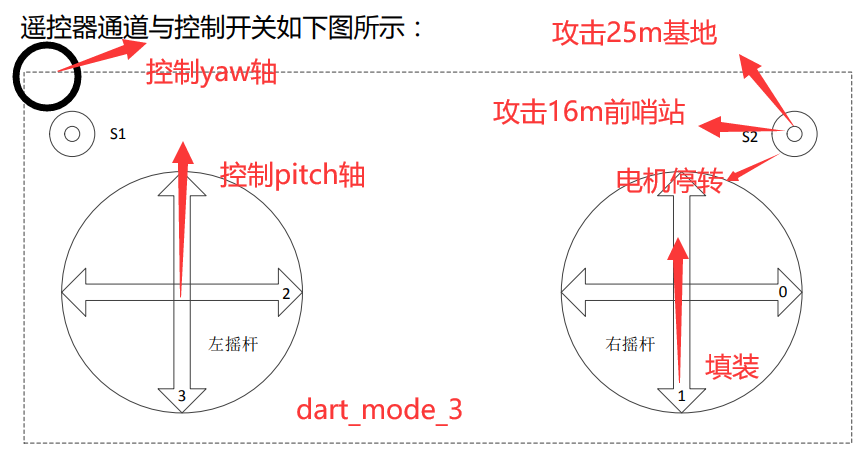
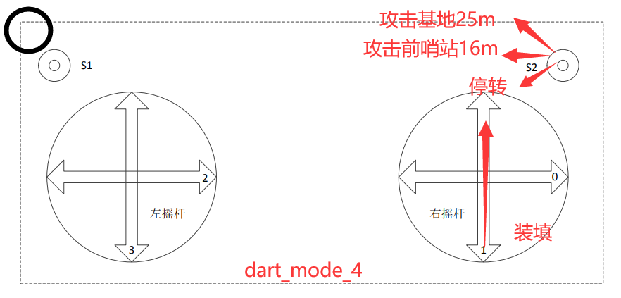

# MechaX 飞镖
##### 使用说明




### 模式选择


### 模式介绍

##### 模式三：自主操作模式

为甚么用摇杆装填？因为用按键容易忘记关



##### 模式四：半自动模式

开关下拨，yaw轴自动偏转至攻击基地的角度。操作手可以填装和发射。当填装后拨的时候，yaw轴会回中



## 功能代码

### 模式选择

```c
//s键 1上 2下 3中
void dart_shoot_task(void const * argument)
{
  dart_init();
  for(;;)
  {
    //模式1 预留
    if(rc_ctrl.rc.s[0] == 1)
    {
      dart_mode_1();
    }
    //模式4 打击基地，此时飞镖会自动转置右方x度，并自动发射飞镖,
    else if(rc_ctrl.rc.s[0] == 2)
    {
      dart_mode_4();
    }
    //模式3 自由调整模式
    else if(rc_ctrl.rc.s[0] == 3)
    {
      dart_mode_3();
    }
  }
}
```

### 模式四核心代码
##### 调整yaw轴

```c
// 自动调节角度，检测到发射结束后，角度回转
void gesture_mode_4()
{
  uint8_t set_speed = 200;

  if(dart.dart_state == 0 && dart.yaw_state == 0)
  {
    for(int i=0;i<9000;i++)
    {
    HAL_GPIO_WritePin(GPIOI,GPIO_PIN_7,SET);
    HAL_GPIO_WritePin(GPIOI,GPIO_PIN_2,SET);
    Delay_us(set_speed);
    HAL_GPIO_WritePin(GPIOI,GPIO_PIN_7,RESET);
    Delay_us(set_speed);
    }
    dart.yaw_state = 1; //表示已经转到指定角度
  }

  if(dart.yaw_state == 2)
  {
    for(int i=0;i<9000;i++)
    {
    HAL_GPIO_WritePin(GPIOI,GPIO_PIN_7,SET);
    HAL_GPIO_WritePin(GPIOI,GPIO_PIN_2,RESET);
    Delay_us(set_speed);
    HAL_GPIO_WritePin(GPIOI,GPIO_PIN_7,RESET);
    Delay_us(set_speed);
    }
    dart.yaw_state = 3; //表示回中操作完成
  }
  
}
```

##### 控制装填
```c

// 模式4 半自动模式，yaw会转动到发射角度，到达指定角度之后操作手可以发射，发射完成后会自动转回
void reload_mode_4()
{
  fp32 speed = dart.speed_reload;

  if(dart.yaw_state >= 1)
  {
    if(rc_ctrl.rc.ch[1]>1224) // 右摇杆往前推
    {
      dart.motor[4].target_speed = speed;
    }
    else if(rc_ctrl.rc.ch[1]<824)  // 右摇杆往后拉 
    {
      dart.motor[4].target_speed = -speed;
      dart.dart_state = 1;
      dart.yaw_state = 2 ;
    }
    else
    {
      dart.motor[4].target_speed = 0;
    }
  }

  reload_speed_send(); 

}

```

##### 发射飞镖

```c
//自由调整模式
//s键 1上 2下 3中
//s[1]左   s[0]右
void dart_mode_3()
{
  fp32 speed_16 = dart.speed_16;
  fp32 speed_25 = dart.speed_25;
         
  if(rc_ctrl.rc.s[0] == 3) 
  {
    HAL_GPIO_WritePin(LED_GREEN_GPIO_Port,LED_GREEN_Pin,GPIO_PIN_SET);
    dart.motor[0].target_speed =  speed_16; 
    dart.motor[1].target_speed =  speed_16;
    dart.motor[2].target_speed = -speed_16;
    dart.motor[3].target_speed = -speed_16;
  

  }
  else if(rc_ctrl.rc.s[0] == 1)
  {
    HAL_GPIO_WritePin(LED_GREEN_GPIO_Port,LED_GREEN_Pin,GPIO_PIN_SET);
    dart.motor[0].target_speed =  speed_25; 
    dart.motor[1].target_speed =  speed_25;
    dart.motor[2].target_speed = -speed_25;
    dart.motor[3].target_speed = -speed_25;

    
  }
  else //最下速度置0
  {
    HAL_GPIO_WritePin(LED_GREEN_GPIO_Port,LED_GREEN_Pin,GPIO_PIN_SET);
    dart.motor[0].target_speed =  0; 
    dart.motor[1].target_speed =  0;
    dart.motor[2].target_speed =  0;
    dart.motor[3].target_speed =  0;

  }

  dart_speed_send();

  osDelay(1); 
}
```


